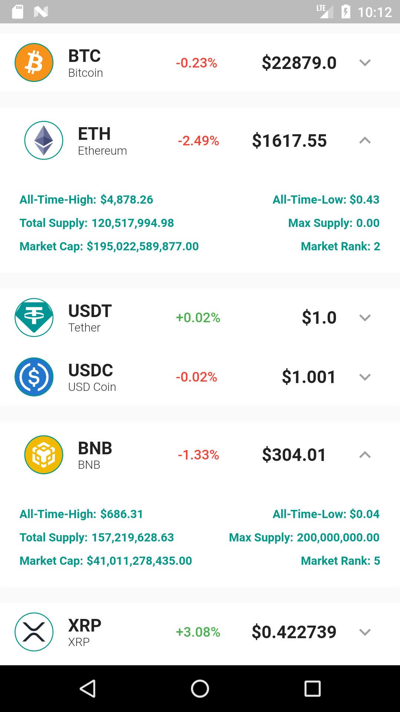

# Coin Tracker

Welcome to coin tracker. A mobile application that helps you keep track of your favourite crypto-currency assets with ease. 

This app follows the Riverpod architecture.

The app uses the following packages/dependencies:

* <a href="https://pub.dev/packages/riverpod" target="_blank">Riverpod</a> for state management
* Firebase for Authentication. (Currently removed from this branch)
* <a href="https://pub.dev/packages/http" target="_blank">Http</a> for querying APIs

The homescreen currently looks like the image below:

## Update (January 23 2023):
- The app now has icons for each asset.
- The app also includes an expandable widget which opens up a separate part on the list itm to display more details for the selected coin.

 new look